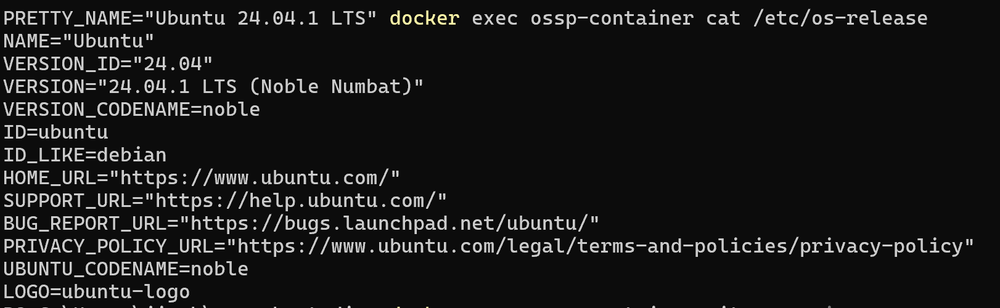
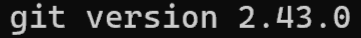
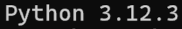
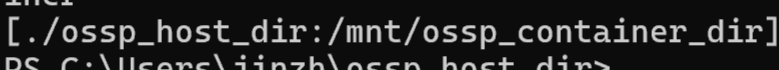

# SWE_2021_41_2024_2_week_6

## Week 4 Assignment
* Link to GitHub repository: [GitHub](https://github.com/tesrsrsf/SWE_2021_41_2024_2_week_4)
  
> ### __Problem Name: *Happy Number*__
> * **Code**: 
> ```python
> def isHappy(n):
>   number = n
>   record = set()
>
>   while number > 1:
>       digits_sqr = []
>       n_str = str(number)
>
>       for i in range(0, len(n_str)):
>           digits_sqr.append(int(n_str[i]) * int(n_str[i]))
>       number = sum(digits_sqr)
>
>       if number in record:
>           return False
>       else:
>           record.add(number)
>
>   return True
> ```
> ---
> * **Explanation**:
>> * **Variables**:
>>> 1. __*n*__: Input value
>>> 2. __*number*__: This is an **int** value that stores the result of each iterations. (It will be updated in each iteration)
>>> 3. __*record*__: This a **set** is used to record which numbers had appeared in past iterations. 
>>> 4. __*digits_sqr*__: This is a **list** that stores the digits of the number.
>>> 5. __*n_str*__: Store number in **string** datatype so that we can access each digit conveniently. 
>> ---
>> * **Process**:
>>> 1. It will first initialize __*number*__ and __*record*__ for future use before iteration starts.
>>> 2. __*digits_sqr*__ is initialized to an empty list at the start of each loop.
>>> 3. __*n_str*__ will store __*number*__ in **string** datatype
>>> 4. The for-loop inside the while-loop will access to each elements of __*n_str*__, and store (append) the squared value of the digit (__int__ datatype) into __*digits_sqr*__. 
>>> 5. __*number*__ will be updated to the sum of the values stored in __*digit_sqr*__.
>>> 6. Check if the updated value of __*number*__ exists in __*record*__. If it exists, it will return **False**, because it means it's in an infinite cycle, which __*n*__ is not a Happy Number. If the value of __*number*__ does not exist in __*record*__, it means it never appeared until now. So we will update the __*record*__ and continue the while-loop
>>> 7. If the value of __*number*__ is **1**, it will stop the loop, and return **True**, because this means __*n*__ is a Happy Number.
> ---
> * **Difficulties**:
>> To be honest, the only problem I had was deciding the method to identify the infinite loop. It took me less than 5 minutes to figure out. 

<br>

## Week 5 Assignment

> **Command**: 
> ```powershell
> docker exec ossp-container cat /etc/os-release
> ```
> ---
> **Output** (screenshot): 
>> 
> ---
> **Explanation**: 
>> Execute `cat /etc/os-release` command (bash) in the `ossp-container`'s terminal to print the content of the file that contains the information of the OS. The output result will be printed in *Windows PowerShell*.
> ---
> **P.S.** Because of the stretch I made to the window of PowerShell, the command I entered is displayed at the wrong location, as shown in the screenshot (and I have no idea how it becomes like that), but I have checked the result, it matches the example given in week5's document. 
> 

<br>

> **Command**: 
> ```powershell
> docker exec ossp-container git --version
> ```
> ---
> **Output** (screenshot): 
>> 
> ---
> **Explanation**: 
>> Execute `git --version` command (bash) in the `ossp-container`'s terminal to output the version of git installed in OS. The output result will be printed in *Windows PowerShell*
>

<br>

> **Command**: 
> ```powershell
> docker exec ossp-container python3 --version
> ```
> ---
> **Output** (screenshot): 
>> 
> ---
> **Explanation**: 
>> Execute `python3 --version` command (bash) in the `ossp-container`'s terminal to output the version of git installed in OS. The output result will be printed in *Windows PowerShell*.
>

<br>

> **Command**: 
> ```powershell
> docker inspect --format="{{ .HostConfig.Binds }}" ossp-container
> ```
> ---
> **Output** (screenshot): 
>> 
> ---
> **Explanation**: 
>> Inspect the Docker container named `ossp-container` and get the volume binding information (mount **paths** between the **host** and the **container**) for the container. Only the contents of the Binds field are output instead of the full docker inspect the output. The output will be printed in *Windows PowerShell*.
> ---
> P.S. I tried to crop the screenshot to only show the output, but due to the limitations of Windows's built-in image editor, I could only crop it like this.
>  

<br>

## Additional Information
### Easter Egg

> 
>
> *One of my favorite paintings recently.*
> 
> <s>*(Please allow me to stabilize my precarious mental status in this way. - by tesrsrsf)*</s>


